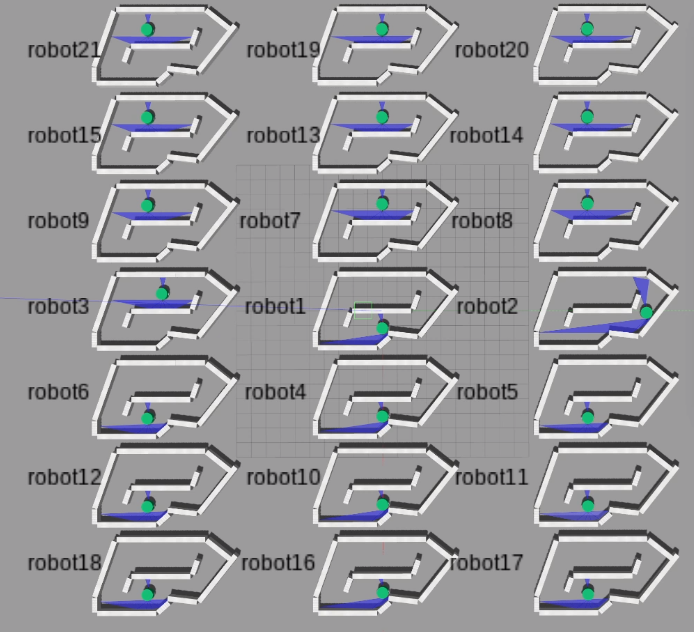

# Algoritmo Genético

## Creado por

    Marqinhos
    
## Ejecución

Primero se deben instalar todos los paquetes necesarios.

- Si queremos emplear **OBS**, debemos tenerlo instalado (su versión de escritorio), después deberemos descargar la librería necesaria (aparece en *requirements.txt*) que es *obs-websocket-py 0.5.3*. A continuación, se mostrará como descargarla.

    ```shell
    pip install obs-websocket-py 0.5.3
    ```

    Además de realizar esta instalación en preciso ir al código de *mainGA.py* y cambiar *HAVE_OBS* a *True*.

    ```python
    HAVE_OBS = True
    ```

- Por otra parte, si queremos emplear todas las versiones que se usaron en las pruebas, simplemente instalamos *requirements.txt*.

    ```shell
    pip install -r requirements.txt
    ```

## Número de agentes (*robots*)
En las pruebas realizadas existe un total de 21 robots, dispersados en diferentes posiciones en un entorno de *gazebo*. A continuación, se mostrará una imagen de éstos.


https://user-images.githubusercontent.com/61009765/208266065-80e7cde9-c022-454f-839e-569e6e14fe2a.mp4


*Como se ve cada robot tiene su respectivo nombre asignado (esto es gracias a una plantilla que hemos creado en **OBS**)*.

## Memoria

Frente a cualquier duda que se pueda generar, así com para ver el análisis de datos, tenemos el archivo *memoria_p1.pdf*, en el que se explica todo de manera mucho más detallada.

- [x] Código con todas las actualizaciones (posibles mejoras que se han comentado).
- [x] Tratamiento y almacenaje de los datos para un futuro análisis.
- [x] Video enseñando el mejor funcionamiento (*video.mkv*).
- [x] Memoria explicando todo el funcionamiento y procesos que se han llevado a cabo (*memoria_p1.pdf*).
- [ ] Funcionamiento genético correcto, es decir, los robots sufren una mejoría substancial.

## Gracias por el interés
